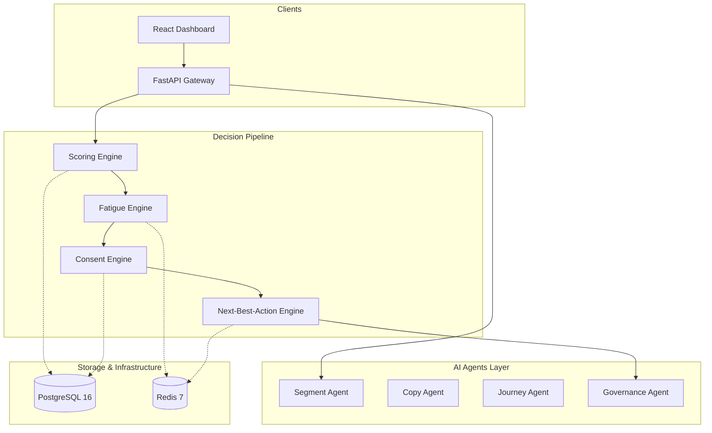

# Architecture Overview

Consentinel is a modern, decoupled system consisting of a FastAPI backend, a React/Vite frontend, and a static website.

## Core System Architecture

## Internal Execution Flow
1. **Event Ingestion**: Events arrive at `/api/events` and are immediately stored in PostgreSQL.
2. **Behavioral Scoring**: The Scoring engine recalculates intent, churn risk, and activation based on the event.
3. **Fatigue Check**: The Fatigue engine computes a score (0.0 to 1.0). If it exceeds the threshold (e.g., 0.8), actions are suppressed.
4. **Consent Gate**: The Consent engine verifies the user's status for the targeted channel against the companion `B2B_Consent_Personalization` hub.
5. **Next Best Action**: The NBA engine synthesizes these signals and outputs the optimal channel, action, and confidence score. If any gate fails, the engine safely returns `channel: "none", action: "none"`.
6. **Agent Enrichment (Optional)**: If the action requires generative copy or journey steps, it calls the AI Agents layer before returning.

For an extensive deep-dive into the models and runtime behavior, read `docs/ARCHITECTURE.md`.
