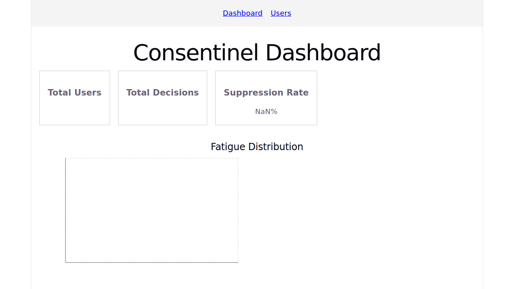
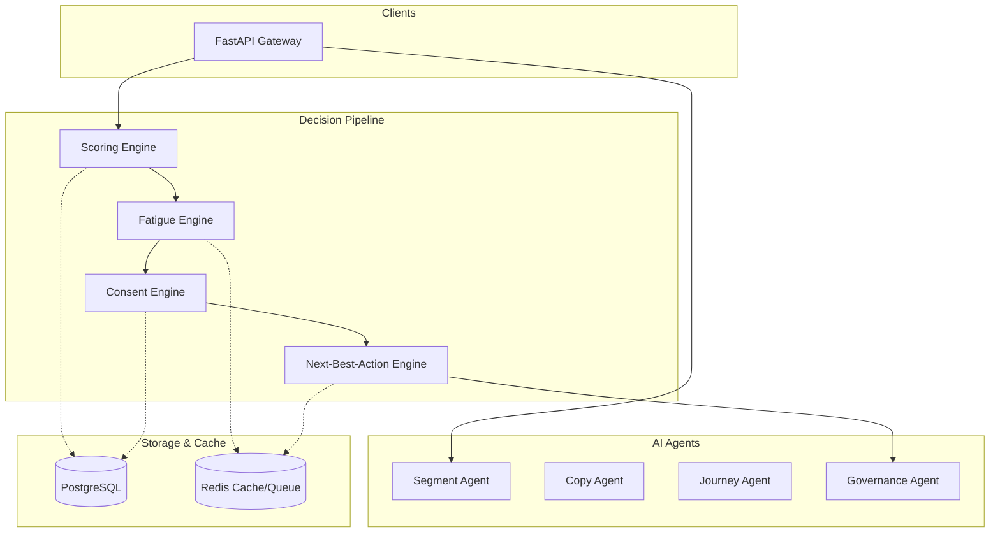

<p align="center">
  
  
</p>

<p align="center">
  <h1 align="center">Consentinel</h1>
</p>

<p align="center">
  <b>The consent-first next-best-action engine for enterprise marketing automation.</b><br/>
  Decide whether to send, what to say, where to deliver, and when to pause.<br/>
  Because sometimes the best marketing action is <i>no action</i>.
</p>

<p align="center">
  <a href="#-quick-start">Quick Start</a> •
  <a href="#-architecture">Architecture</a> •
  <a href="docs/API.md">API Docs</a> •
  <a href="docs/DEPLOYMENT.md">Deployment</a> •
  <a href="docs/DEVELOPMENT.md">Getting Started</a>
</p>

<p align="center">
  <a href="https://github.com/DARREN-2000/Consentinel/actions/workflows/ci.yml"></a>
  <a href="https://python.org"></a>
  <a href="https://fastapi.tiangolo.com/"></a>
  <a href="https://github.com/DARREN-2000/Consentinel/blob/main/LICENSE"></a>
  <a href="https://hub.docker.com/"></a>
  <a href="https://helm.sh/"></a>
</p>

<br/>

Most marketing platforms assume every user *should* receive a message. **Consentinel** challenges that assumption.

Consentinel is a robust, consent-first AI decision engine that evaluates each user individually before acting. It verifies consent, checks fatigue levels, applies suppression rules, and leverages behavioral scoring to orchestrate the *next best action*. If a user is fatigued, outside quiet hours, or lacks consent, Consentinel returns a definitive `channel: "none"`—halting outreach to build trust and preserve brand equity.

<div align="center">
  
  <p><i>Live AI Agent evaluations, Next-Best-Action metrics, and suppression monitoring.</i></p>
</div>

---

## 🎯 Core Features

| Feature | Description |
|---------|-------------|
| 🛑 **"Do Nothing" NBA** | The engine can natively decide to suppress actions, reducing noise and increasing user trust. |
| 🛡️ **Consent-First Architecture** | Every decision is gated by strict, verified consent rules integrated with [ConsentHub](https://github.com/DARREN-2000/B2B_Consent_Personalization). |
| 🧠 **Behavioral Scoring** | Real-time intent, churn risk, activation, and fatigue scoring computed for every event. |
| 🔇 **Fatigue Management** | Automatic message suppression when daily/weekly frequency caps are exceeded. |
| 🗺️ **Journey Orchestration** | Multi-step automated journeys evaluated contextually against consent gates. |
| 🧪 **Experimentation** | Built-in A/B testing framework to optimize next-best actions. |
| 🤖 **AI Agents Layer** | Pluggable OpenAI-powered agents for Segmentation, Copywriting, Journeys, and Governance. |
| 📊 **Advanced Analytics** | Built-in dashboards for cohort analysis, funnels, attribution, and AI decision explainability. |

---

## 🏗️ Architecture Overview

Consentinel is built for enterprise scale, using a modern Python data stack with strict type checking, robust orchestration, and comprehensive telemetry.



For the complete architectural design, data models, and request flows, see [Architecture Deep Dive](docs/ARCHITECTURE.md).

---

## 🚀 Quick Start

Get Consentinel running locally in under 3 minutes.

### Prerequisites
* Docker 24+
* Docker Compose v2+
* Make

### 1. Launch the Stack
```bash
# Clone the repository
git clone https://github.com/DARREN-2000/Consentinel.git
cd Consentinel

# Configure environment variables
cp .env.example .env

# Start the services (FastAPI, PostgreSQL, Redis, UI)
make up
```

### 2. Verify Health
```bash
curl -s http://localhost:8000/api/health | jq
```
```json
{
  "status": "healthy",
  "version": "1.0.0",
  "timestamp": "2024-05-18T12:00:00Z"
}
```

### 3. Ask for a Decision
Create a user and ask the engine for the next best action:

```bash
# Register User
curl -X POST http://localhost:8000/api/users \
  -H "Content-Type: application/json" \
  -d '{"email": "jane@example.com", "name": "Jane", "lifecycle_stage": "trial"}'

# Ask NBA Engine
curl -X POST http://localhost:8000/api/decisions/next-best-action \
  -H "Content-Type: application/json" \
  -d '{"user_id": 1}'
```

---

## 📚 Documentation

The repository contains extensive documentation for developers and operators:

* [Getting Started](docs/DEVELOPMENT.md) - Comprehensive setup and initialization guide.
* [Architecture Guide](docs/ARCHITECTURE.md) - System design, engine flow, and AI agent integration.
* [API Reference](docs/API.md) - Complete endpoints, schemas, and usage examples.
* [Deployment Guide](docs/DEPLOYMENT.md) - Production deployment via Kubernetes, Helm, and Docker Compose.
* [Development Guide](docs/DEVELOPMENT.md) - Local setup, testing conventions, and contribution standards.

---

## 🧪 AI Agents

Consentinel leverages specialized AI agents to handle non-deterministic tasks, all governed by a strict rule layer:

* **Copy Agent**: Generates contextual, localized messaging based on user state and product data.
* **Segment Agent**: Evaluates user attributes and assigns them to dynamically updating cohorts.
* **Journey Agent**: Recommends the next logical step in a multi-stage user journey.
* **Governance Agent**: Reviews proposed actions against safety, brand compliance, and consent rules before execution.

All agents degrade gracefully to deterministic fallbacks if LLM services are unavailable.

---

## 💻 Tech Stack

| Component | Technology |
|-----------|------------|
| **Core API** | Python 3.12, FastAPI 0.115, Pydantic 2.10 |
| **Data Layer** | PostgreSQL 16, SQLAlchemy 2.0, Alembic |
| **Caching/Queue**| Redis 7 |
| **Frontend** | React, Vite, Recharts |
| **Observability**| Prometheus, OpenTelemetry |
| **Infrastructure**| Docker, Kubernetes (Helm), GitHub Actions |
| **AI/LLM** | OpenAI API |

---

## 🤝 Contributing

We welcome contributions! Whether it's submitting a bug report, writing a new feature, or fixing a typo, your help is appreciated.

Please see our [Contributing Guidelines](CONTRIBUTING.md) for details on how to get started, run tests, and format your code.

<p align="center">
  <a href="CONTRIBUTING.md">Read the Contributing Guide</a> •
  <a href="https://github.com/DARREN-2000/Consentinel/issues?q=is%3Aissue+is%3Aopen+label%3A%22good+first+issue%22">Good First Issues</a>
</p>

---

## 🛡️ License

Consentinel is open-source software licensed under the **[Apache License 2.0](LICENSE)**.

<p align="center">
  <br/>
  Built with ❤️ for marketers who respect their users.
</p>